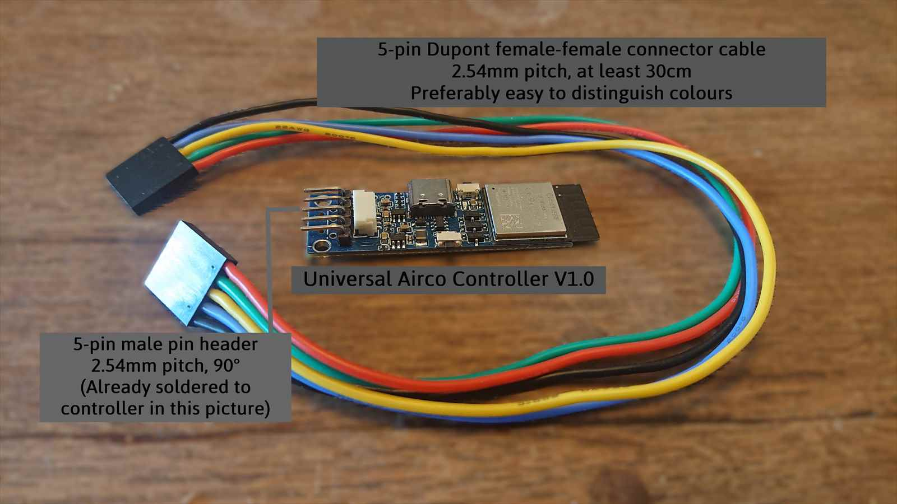
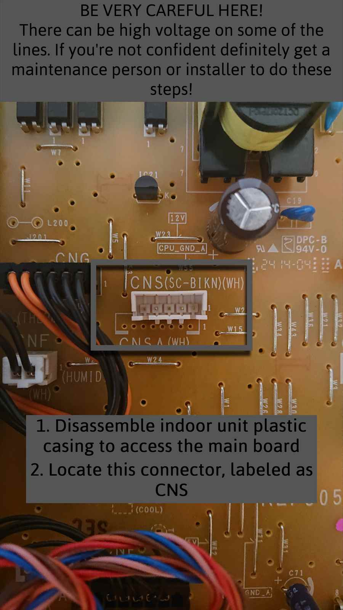
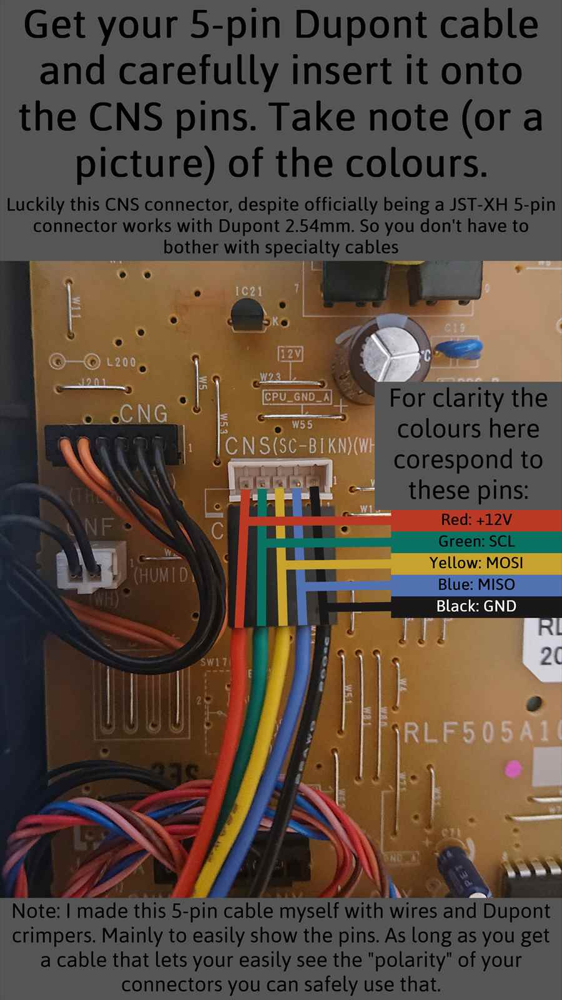
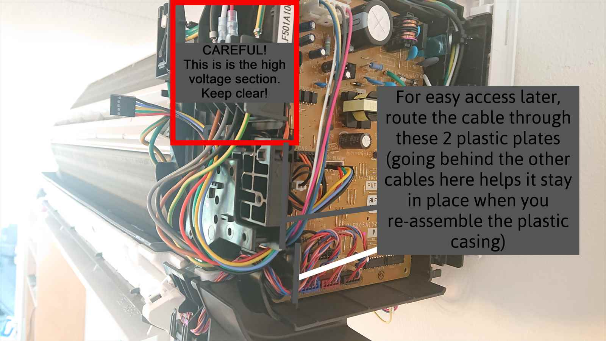
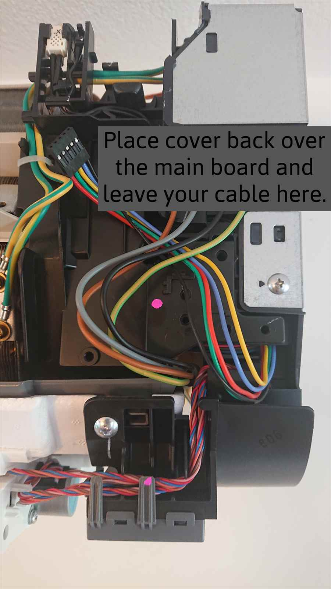
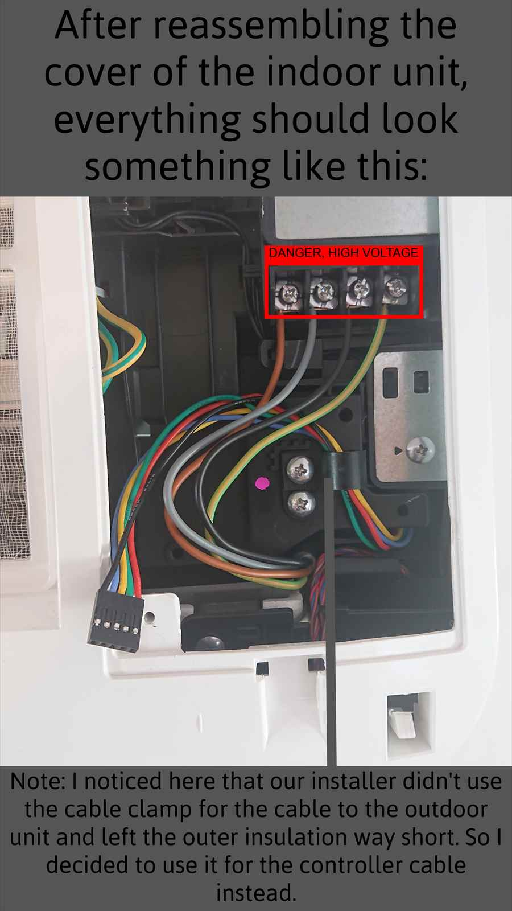
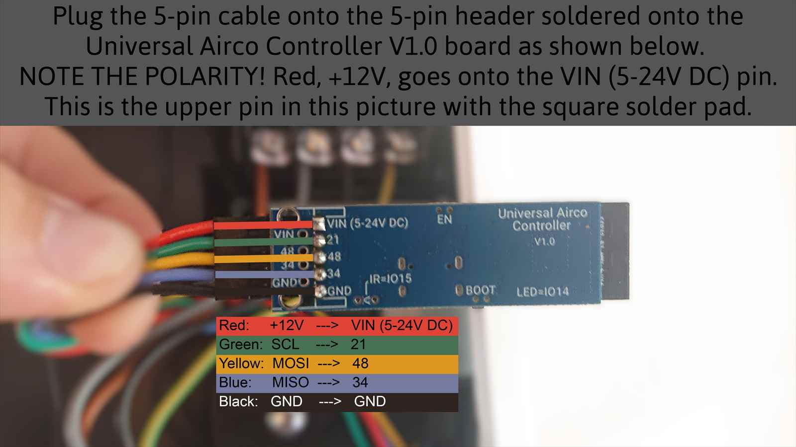
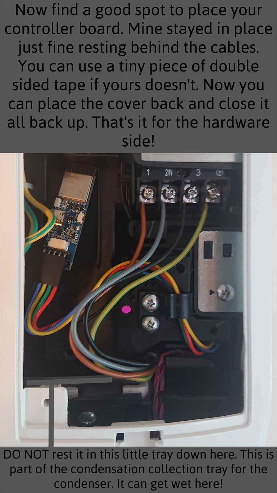

# There is an unresolved issue with the universal airco controller!  https://github.com/ginkage/MHI-AC-Ctrl-ESPHome/issues/196
# Hardware

Hardware used:

- Universal Airco Controller v1.0 (ESP32-S3 based)
- 5-pin female-to-female Dupont connector cable
- 5-pin, 90-degree male pin header

These instructions document one example of installing an ESP-based controller inside an AC indoor unit. The installation method will vary depending on the controller hardware and AC model being used.

## Installation

All required parts.

Locating the connector on the main board.

Plug your connector into the CNS port.

Route the cable behind the plastic cover.

Further guide the cable.

After reassembling the indoor unit plastic casing.

Connect the universal airco controller to the cable.

Place your controller somewhere safe in the unit.
