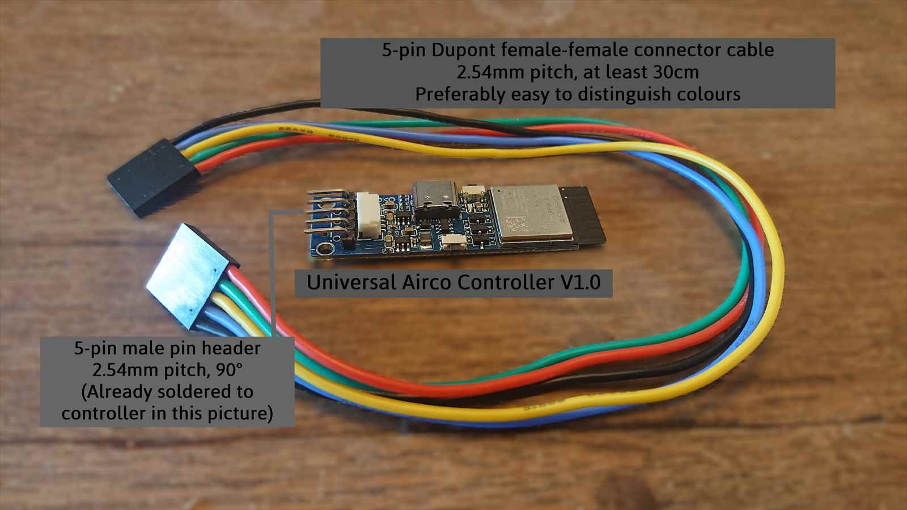
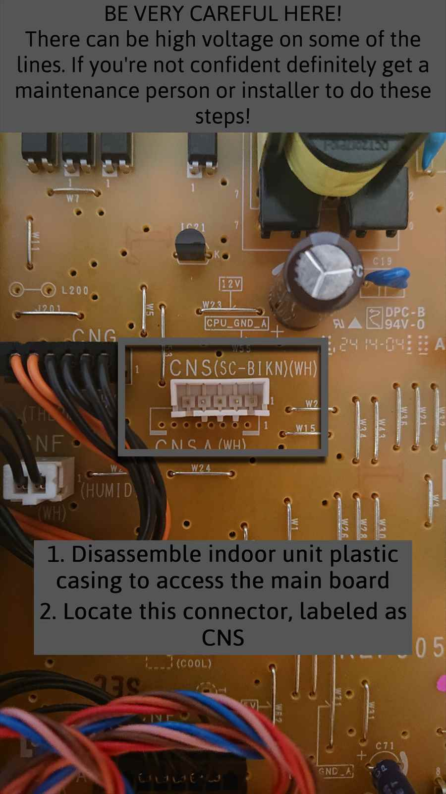
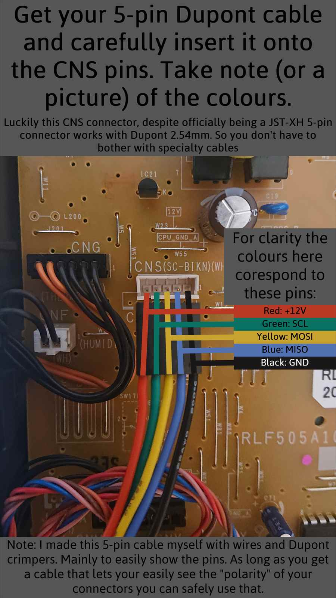
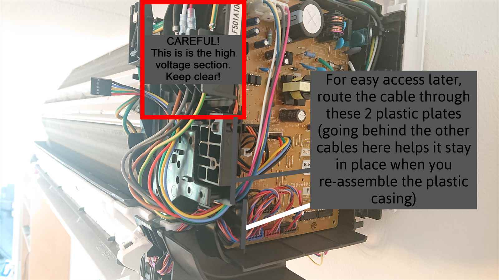
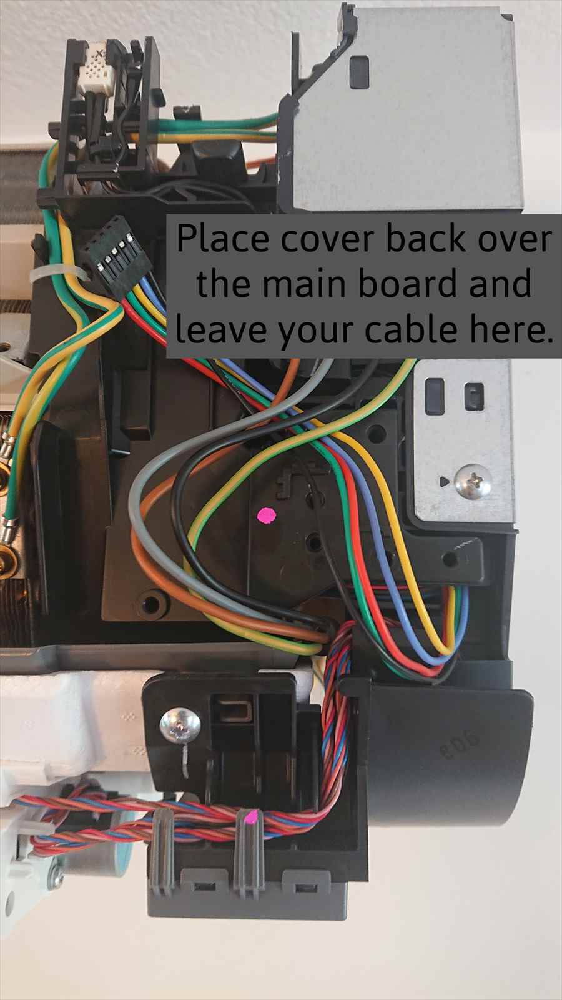
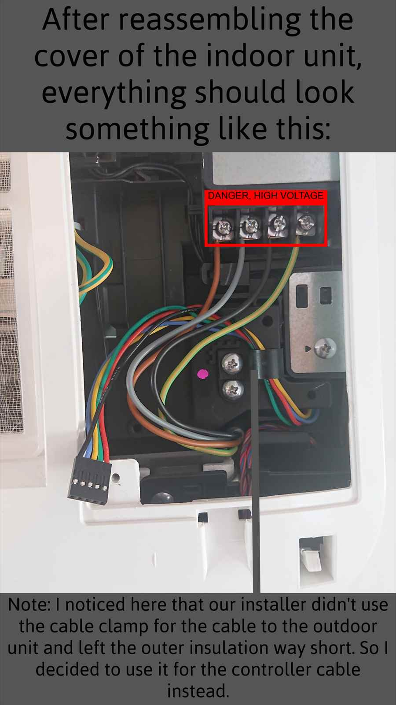
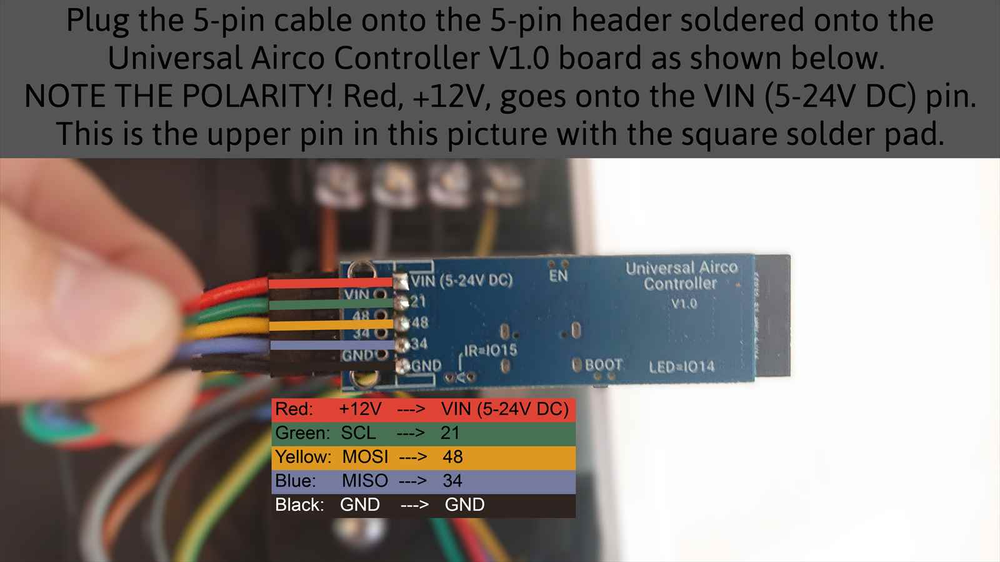
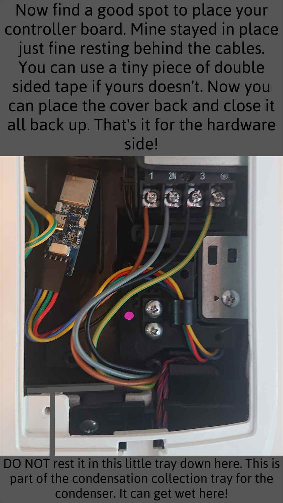

# Universal Airco Controller installation

This guide documents one installation of a **Universal Airco Controller v1.0** based on ESP32-S3. Board revisions and air-conditioner models can differ, so verify the connector, voltage, and GPIO mapping before installation.

> [!WARNING]
> Disconnect mains power before opening the indoor unit. Installation inside an air conditioner exposes mains-powered equipment and should be performed by a suitably qualified person.

> [!NOTE]
> An older upstream compatibility report is tracked in [ginkage/MHI-AC-Ctrl-ESPHome issue 196](https://github.com/ginkage/MHI-AC-Ctrl-ESPHome/issues/196). This repository uses a newer ESP-IDF transport architecture, but that does not establish compatibility with every controller revision or MHI model.

## Recommended configuration

Use the repository example:

- [`examples/UniversalAircoController.yaml`](../examples/UniversalAircoController.yaml)

The current example uses:

```yaml
MhiAcCtrl:
  frame_size: 33
  sck_pin: 14
  mosi_pin: 13
  miso_pin: 12
  rx_driver: rmt_cs_spi
  rmt_spi_frame_gap_us: 1000
  command_worker: true
```

`rmt_cs_spi` is the integrated FIFO-backed RX/TX transport for ESP32-S3. It derives an internal transaction boundary from the SCK idle gap, so there is no physical CS pin and no separate `tx_driver` setting.

The pin values above are retained from the v1.0 example. Confirm them against the specific board revision before flashing. Use `frame_size: 20` instead of `33` for an older unit that does not use the extended frame format.

See also:

- [Driver selection](../docs/drivers/README.md)
- [Diagnostics](../DIAGNOSTICS.md)
- [SPI transport findings](../notes/FINDINGS_SPI_TRANSPORTS.md)

## Hardware used

- Universal Airco Controller v1.0 (ESP32-S3 based)
- 5-pin female-to-female Dupont connector cable
- 5-pin, 90-degree male pin header

These instructions show one way to install an ESP-based controller inside an AC indoor unit. The physical installation will vary with the controller hardware and AC model.

## Installation

All required parts.


Locating the connector on the main board.


Plug the connector into the CNS port.


Route the cable behind the plastic cover.


Continue routing the cable so it cannot be pinched during reassembly.


Reassemble the indoor-unit casing.


Connect the Universal Airco Controller to the cable.


Secure the controller so it cannot contact moving parts, hot surfaces, condensation, or exposed mains wiring.


## First startup

Start with `logger.level: INFO`. Confirm that the configured frame size is accepted and that valid frames, command confirmations, and opdata continue to advance. Review [Diagnostics](../DIAGNOSTICS.md) before reducing logging for a longer soak.
